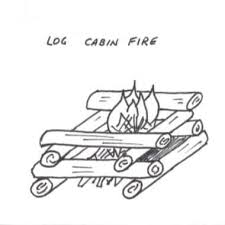

# *How to Build a Fire*
**Do you believe you may become lost in the wilderness? Are you hosting an outdoor get-together for your friends and family? No matter the reason, knowing how to build a blazing fire is essential.**

# *Learn to Burn!*
### 1.  Find a location 
* Ensure that the spot is clear from any dry materials, such as dry grass and leaves. 

### 2. Gather materials.
* Ensure that the spot is clear from any dry materials, such as dry grass and leaves.Ideally, the dry materials should fall under three categories, tinder, kindling, and fuel wood. 
* Tinder allows the fire to start fast using dry leaves or bark.
* Kindling preserves the tinder's flame with small twigs and branches.
* Fuel wood is used to keep the fire burning for extended periods of time with large logs

### 3. Type of campfire
**Note**: follow the path of your chosen campfire (a, b, c).

* There are many different types of campfire constructions; the three that we will focus on are the Lean-To, the Tepee, and the Log Cabin. 
* The Lean-To fire (a) is best for poor conditions, such as wind and dampness.
* The Tepee fire (b) provides even heat and can be easily lit.
*The Log Cabin fire (c) offers a slow burn with a flat top, which is most ideal for cooking. 

      
### 4(a). Build the Lean-To 
* Place a large log.
* Lean kindling against the placed log.
* Set tinder underneath the sheltered area.
* Light the tinder

### 4(b). Build the Tepee
* Place tinder in center of the fire's location.
* Lean kindling around the tinder, creating a circle.
* Light the tinder at the base.

### 4(c). Build the Log Cabin
* Place two logs parallel to one another, then two perpendicular on top.  
* Add kindling and tinder inside of the box.
* Light the tinder in the box

### 5. Feed the fire
* Add fuel logs or kindling to the fire to keep it going.

### 6. Put out the fire
* When you are done, it is important to extinguish the fire with water.
* Failure to do so could result in a forest or home fire.

